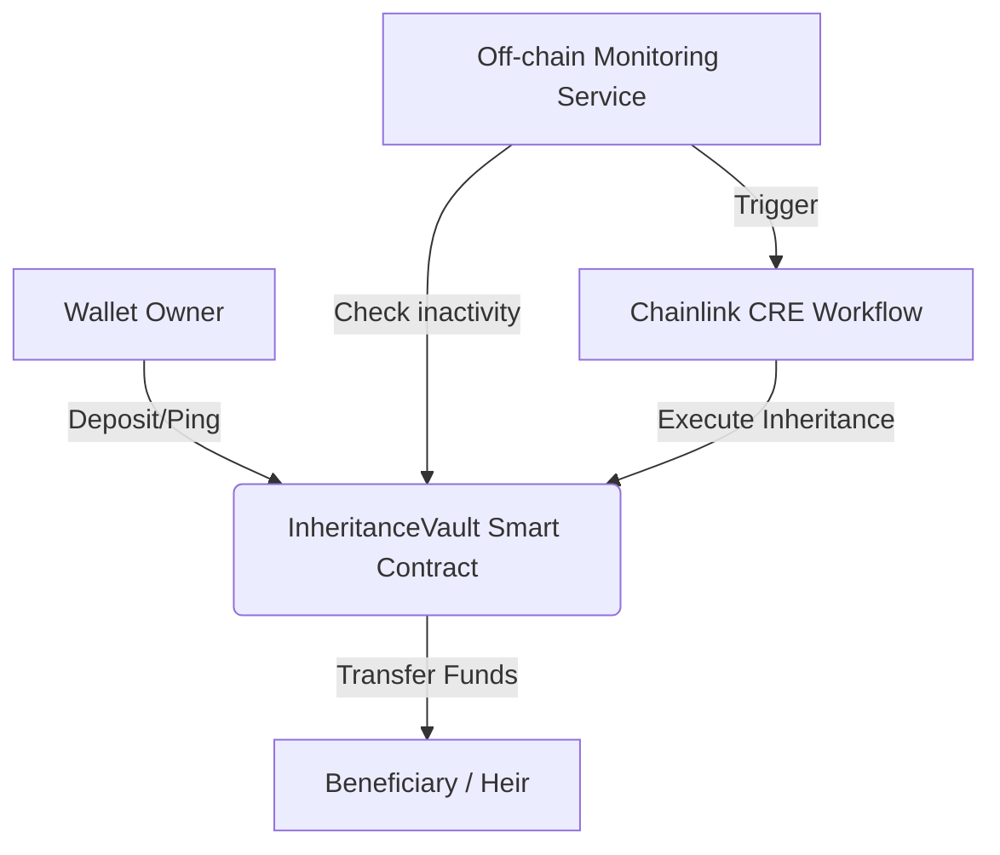

# DEADMANSWITCH AI – Autonomous Crypto Inheritance Protocol

**DEADMANSWITCH AI** is a production-quality protocol demonstrating how Chainlink Runtime Environment (CRE) can automate crypto inheritance using off-chain monitoring and on-chain execution.

## 🏗 Architecture



## 🖥 Frontend Dashboard
The project includes a premium **Web3 Dashboard** located in the `deadmanswitch-ui/` directory.

## 🚀 Live Deployment Details (Base Sepolia)
The protocol is currently deployed and live:
- **Network**: Base Sepolia
- **Contract Address**: `0x397714f3a73F14DFC5751B85465de221f63Cdb5e`
- **Explorer**: [BaseScan](https://sepolia.basescan.org/address/0x397714f3a73F14DFC5751B85465de221f63Cdb5e)

## 🛠 Installation & Local Setup

### Prerequisites
- Node.js & npm
- Injected Wallet (MetaMask)

### Installation
```bash
npm install
cd deadmanswitch-ui && npm install
```

## 🤖 Running the Simulation
To simulate the DeadmanSwitch lifecycle locally:
1. Ensure your `.env` has the correct `PRIVATE_KEY`.
2. Run:
```bash
npx ts-node src/monitor.ts
```

## 🌐 Vercel Deployment
To deploy the dashboard to Vercel, set the following environment variables:
- `NEXT_PUBLIC_WALLETCONNECT_PROJECT_ID`: Your WalletConnect ID.
- `NEXT_PUBLIC_VAULT_ADDRESS`: `0x397714f3a73F14DFC5751B85465de221f63Cdb5e` (Live Base Sepolia Contract)

## 📜 Security & Reliability
- [x] **Owner-only Access Control**: Verified via `onlyOwner`.
- [x] **Automation-only Trigger**: Verified via `onlyAutomation`.
- [x] **Safe ETH Transfer**: Implements `call` pattern.
- [x] **SSR Safe**: Next.js hydration mismatch issues resolved.

---
**Hackathon submission code.** | Powered by Chainlink CRE.
