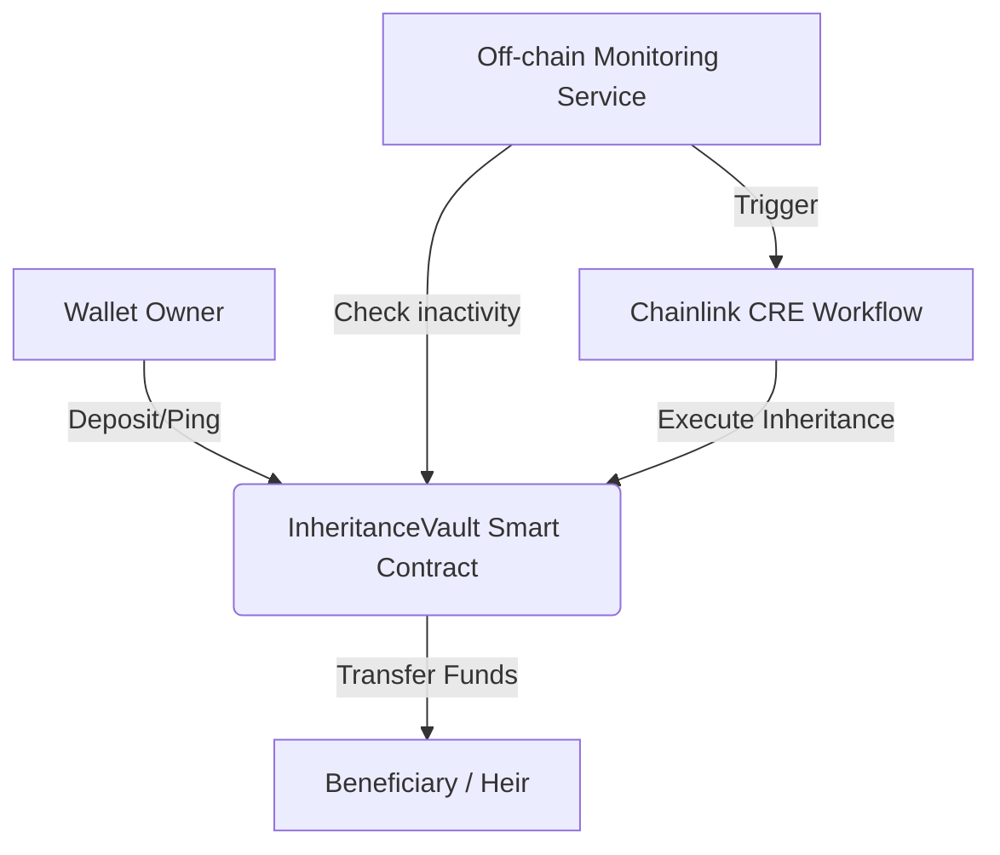

# DEADMANSWITCH AI – Autonomous Crypto Inheritance Protocol

**DEADMANSWITCH AI** is a production-quality protocol demonstrating how Chainlink Runtime Environment (CRE) can automate crypto inheritance using off-chain monitoring and on-chain execution.

## Architecture



## Frontend Dashboard
The project includes a premium **Web3 Dashboard** located in the `deadmanswitch-ui/` directory.

## Live Deployment (Base Sepolia)
- **Network**: Base Sepolia (Chain ID: 84532)
- **Contract Address**: `0x7aD44599A09656D0430D939510c1991A85d8fb73`
- **Explorer**: [BaseScan](https://sepolia.basescan.org/address/0x7aD44599A09656D0430D939510c1991A85d8fb73)

## Installation & Local Setup

### Prerequisites
- Node.js v18+ & npm
- MetaMask or similar injected wallet

### Installation
```bash
# Root project (smart contracts, backend)
npm install

# Frontend
cd deadmanswitch-ui && npm install
```

### Environment Variables
Create a `.env` file in the project root:
```
PRIVATE_KEY=your_wallet_private_key
SEPOLIA_RPC_URL=https://ethereum-sepolia-rpc.publicnode.com
BASE_SEPOLIA_RPC_URL=https://sepolia.base.org
```

**Never commit `.env` to git.**

## Smart Contract

### Compile
```bash
npx hardhat compile
```

### Deploy to Base Sepolia
```bash
npx hardhat run scripts/deploy.ts --network baseSepolia
```

### Deploy to Sepolia
```bash
npx hardhat run scripts/deploy.ts --network sepolia
```

### Verify on Etherscan
```bash
npx hardhat verify --network baseSepolia CONTRACT_ADDRESS
```

## Running the Simulation
To simulate the DeadmanSwitch lifecycle locally:
1. Start a local Hardhat node: `npx hardhat node`
2. Deploy locally: `npx hardhat run scripts/deploy.ts --network localhost`
3. Run simulation: `npx ts-node src/monitor.ts`

## Frontend Development

```bash
cd deadmanswitch-ui
npm run dev    # Start dev server at http://localhost:3000
npm run build  # Build for production
```

## Vercel Deployment
Set the following environment variables in Vercel dashboard:
- `NEXT_PUBLIC_WALLETCONNECT_PROJECT_ID`: Your WalletConnect project ID
- `NEXT_PUBLIC_VAULT_ADDRESS`: Deployed contract address

## Demo Flow
1. Connect wallet (MetaMask on Base Sepolia)
2. Register heir wallet address + set inactivity threshold
3. Deposit ETH into the vault
4. Ping "I'm Alive" to reset the timer
5. View vault status (owner, heir, balance, last ping)

## Security
- [x] Owner-only access control (`onlyOwner` modifier)
- [x] Automation-only inheritance trigger (`onlyAutomation` modifier)
- [x] Reentrancy guard on `executeInheritance`
- [x] Safe ETH transfer via `call` pattern
- [x] Timestamp validation for inactivity threshold
- [x] SSR-safe frontend (hydration mismatch resolved)

---
**Hackathon submission** | Powered by Chainlink CRE
